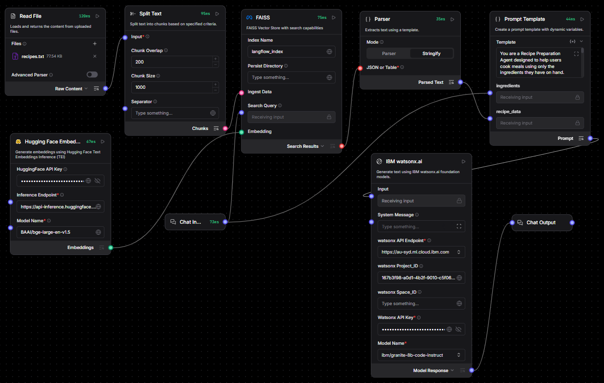

# Recipe Preparation Agent

## Overview

A Retrieval-Augmented Generation (RAG) based AI assistant that helps users prepare meals using only the ingredients available to them.

Built using IBM Granite, IBM watsonx.ai, FAISS Vector Store, Hugging Face Embeddings, and LangFlow.

## Problem Statement

Users often struggle to decide what to cook with limited ingredients, leading to food waste and inefficient meal planning.

This system retrieves relevant recipes from a recipe knowledge base and generates personalized cooking instructions, substitutions, and dietary adaptations.

## Features

- Ingredient-based recipe recommendations
- RAG-powered recipe retrieval
- Step-by-step cooking instructions
- Ingredient substitution suggestions
- Dietary adaptation support
- Food waste reduction

## Technology Stack

- LangFlow
- IBM watsonx.ai
- IBM Granite-8B-Code-Instruct
- FAISS Vector Store
- Hugging Face Embeddings (BAAI/bge-large-en-v1.5)
- Retrieval-Augmented Generation (RAG)

## Architecture

## Workflow

## Project Flow

User Ingredients
→ Semantic Search
→ FAISS Retrieval
→ Recipe Context
→ IBM Granite
→ Recipe Generation
→ Chat Output

## Future Scope

- Mobile Application
- Voice Assistant
- Multilingual Support
- Smart Pantry Management
- Nutrition Analysis

## Author

Shreya Ghosh
B.Tech CSBS
Institute of Engineering & Management
